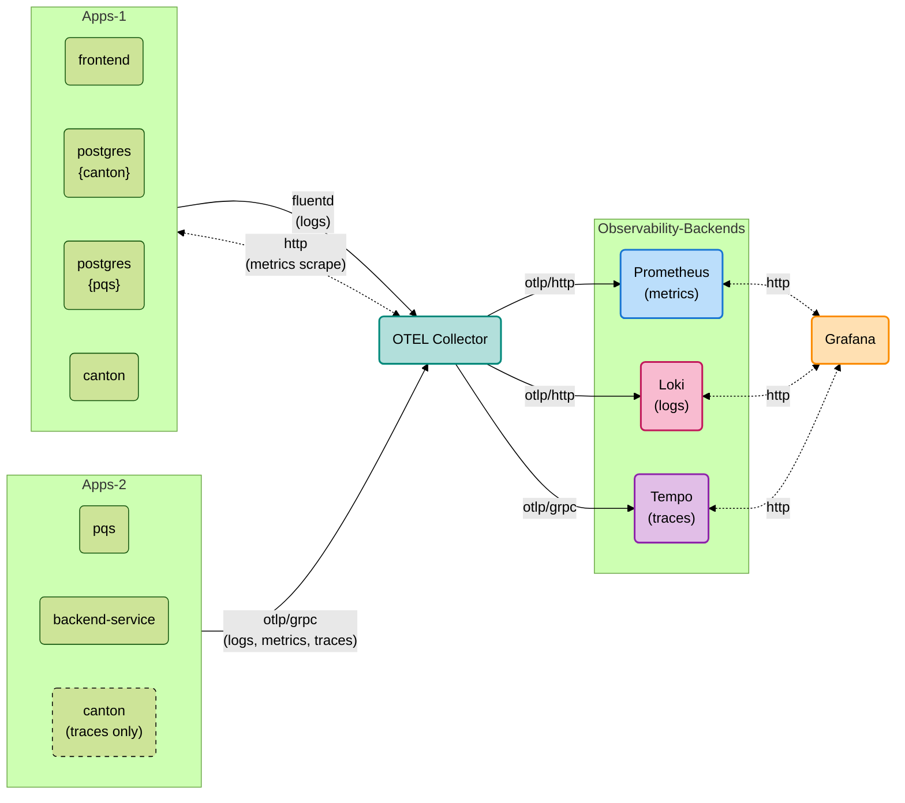

# Introduction

Canton Network Application Quickstart provides a set of observability services to help developers monitor and debug
their applications.

The observability signals (logs, metrics, traces) are powered by well-known open-source projects.
The UI of Grafana has everything one needs to visualize and analyze the data with preconfigured datasources and settings
to allow seamless navigation between different signal types.

# Topology
The graph below schematically represents the flow of observability signals in the Quickstart.



# Running

To start the observability services, set ``OBSERVABILITY_ENABLED`` to ``true`` in ``.env.local`` in the ``quickstart`` directory, and it will be started together with the application services when you run
```shell
$ make start
```

Then navigate to [http://localhost:3030](http://localhost:3030) to access the Grafana UI.
