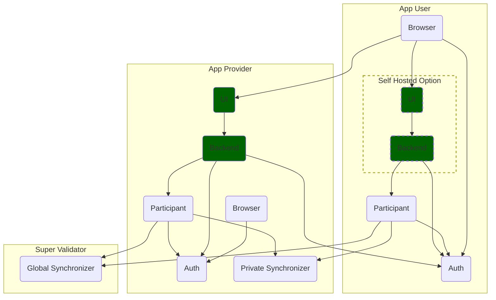
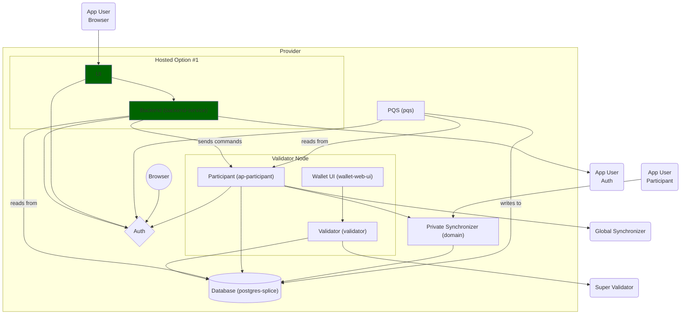
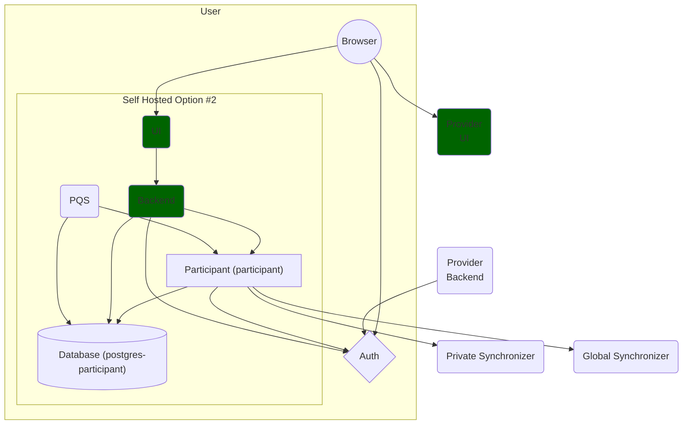
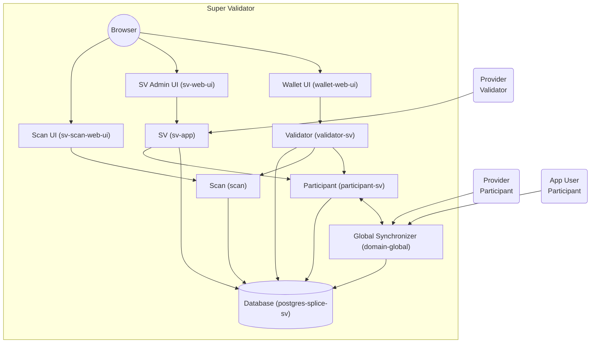

# Canton Network Quickstart Infrastructure Overview

This document provides an overview of the Canton Network infrastructure and the environment in which the Quickstart App operates. 
The diagrams below illustrate the relationships between Users, Providers, and the Super Validator, as well as the internal components that make up the system. 
The focus of ``Canton Network Quickstart`` is to provide a development environment for App Providers - the provision of Super Validator infrastructure is auxiliary.

## High Level Structure

This diagram summarizes the interaction between App Providers and App Users (organizations) through services and synchronization domains.

### Description

This high-level diagram focuses on the relationships between three main entities: the **App User**, the **App Provider**, and the **Super Validator**.

- **Key Definitions**
  - **App Provider**: The entity that operates the backend and is responsible for providing the app interface, services, and infrastructure. Acts on the behalf of **App Users**.
  - **App User**: An organization with its own Daml party that has subscribed to the App, allowing access for its own users (referred to as **End Users**).
  - **End User**: The natural person(s) belonging to an App User, i.e. an organization member, who uses the app. End Users are represented by the App User's Daml party and do not have their own. They authenticate individually through the App User's **Auth** service.

- **App User:**
  - **Browser:** Used by the End Users to access the application interface.
  - **Auth:** Service administered by the App User to authorize End Users to use the App.
  - **Participant Node:** Represents the App User's node in the Canton Network.
  - **Self-Hosted Option:** An optional setup (not currently the default) where the User self-hosts their own **UI** and **Backend** services. This can provide additional trust properties, as well as the possibility of integrating with other services.

- **App Provider:**
  - **Auth:** Service used by the **Backend** and **PQS** to authorize access to the **Participant**.
  - **UI and Backend:** The App Provider's application interface and logic. These components interact with the End User's Browser and are responsible for executing business logic, such as submitting transactions to the **Participant**.
  - **Participant Node:** The Provider's node in the Canton Network.
  - **Private Synchronizer:** A synchronization domain operated by the Provider for transactions that do not require the Global Synchronizer.

- **Super Validator:**
  - **Global Synchronizer:** Operated by the Super Validator, this component is the backbone of the global Canton Network and allows transactions involving Canton Coin on the Global Domain.

- **Interactions:**
    - End Users access the application via their Browser, which communicates with the Provider's UI.
    - The Backend confirms that End Users are authorized to act on behalf of the App User via the App User's provided Auth service.
    - The App Provider's Auth service is used for authentication of parties that represent App Users.

---

## App Provider Infrastructure

### Description

This diagram shows the **App Provider's** infrastructure within the Canton Network Quickstart environment.

- **App Provider Components:**
  - **Auth:** Authentication service used by the **Backend** and **PQS** to connect to the **Participant** as the Ledger API user (``"quickstart"``) to act on the App Users' behalf.
  - **UI and Backend (Hosted Option #1):** The Provider hosts the application **UI** and **Backend** services, which handle user interactions and business logic. These are custom components specific to the application, which read ledger content from the PQS database and submit transactions to the **Participant**.
  - **PQS (Participant Query Store):** Writes ledger content related to the Provider's and all Users' parties to the **Database**, to be used and processed by the backend.
  - **Private Synchronizer:** A domain operated by the Provider to facilitate transactions with Users that do not require the Global Domain.
  - **Database (postgres-splice):** Stores application data, including transaction records and user information.
  - **Validator Node:**
    - **Participant (ap-participant):** Executes transactions on behalf of the Provider's parties. May be authorized to act on behalf of User parties.
    - **Validator (validator):** Manages Canton Coin operations and validates transactions.
    - **Wallet UI (wallet-web-ui):** Interface for managing Canton Coin holdings and transactions.

- **Interactions:**
  - **Internal:**
    - The **App UI** communicates with the **Backend** and **Auth** services.
    - The **Backend** interacts with the **Participant** node to execute transactions and reads from the **Database**.
    - The **PQS** reads data from the **Participant** node and writes to the **Database** for query purposes.
    - The **Participant** node connects to the **Private Synchronizer** for transactions not requiring the Global Synchronizer.
    - The **Validator Node** components manage Canton Coin operations and connect to the **Database**.
  - **External:**
    - **App User Interaction:** Users' Browsers access the Provider's **App UI**. The **App Provider Backend** interacts with the **App User's Auth** service for authentication of End Users connecting through the UI, and with the **App Provider's Auth** to authenticate the User's party with the participant.
    - **Super Validator Interaction:** The **App Provider's Validator** connects to the **Super Validator App**, integrating with the network's governance and operational processes. The **Participant** node connects to the **Global Synchronizer** for transactions on the global domain.
    - **App User Participants:** Users' Participant nodes connect to the Provider's **Private Synchronizer** for transactions that do not require the Global Synchronizer or Canton Coin.

---

## App User Infrastructure

### Description

This diagram presents a view of the **App User's** infrastructurem including the option of choosing the self-hosted setup (Self Hosted Option #2), in the Canton Network Quickstart environment.

- **App User Components:**
  - **Browser:** Used by End Users to access the self-hosted, or the Provider-hosted application interfaces if not self-hosting.
  - **Auth:** An authentication service provided by the App User to authenticate and authorize End Users to the App Provider to act on behalf of the App User.
  - **Self-Hosted Components:**
    - **UI and Backend:** Custom application interface and logic hosted by the User, allowing for greater control over user experience and data handling.
    - **Participant (participant):** The User's node in the Canton Network, executing transactions on behalf of the User's parties.
    - **Database (postgres-participant):** Stores the User's transaction data and application-specific information.
    - **PQS (Participant Query Store):** Facilitates querying ledger data from the User's Participant node and writes to the User's Database.

- **Interactions:**
  - **Internal:**
    - The **App User Browser** connects to the User's **Auth** service and accesses the self-hosted **UI**.
    - The **UI** communicates with the **Backend**, which processes user requests and business logic.
    - The **Backend** interacts with the **Participant** node to execute transactions and reads ledger content from the PQS **Database**. May also use its own database for off-ledger backend state.
    - The **Participant** node communicates with the **Auth** service to authenticate App User parties.
    - The **PQS** reads ledger content from the **Participant** node and writes it to the **Database**.
  - **External:**
    - **App Provider Interaction:** It not chosing the self-hosted option, the **App User Browser** accesses the **App Provider's UI** for functionalities. The **App Provider's Backend** communicates with the **App User's Auth** service to authenticate End Users.
    - **Synchronizers:**
      - The **App User's Participant** node connects to the **App Provider's Private Synchronizer** for transactions between the User and Provider.
      - It also connects to the **Global Synchronizer** operated by the Super Validator for transactions on the Global Synchronizer, allowing interactions with other network participants.

---

## Super Validator Infrastructure

### Description

This diagram illustrates the components of the **Super Validator** node, that operates the **Global Synchronizer** and oversees network governance and consensus. 
While operating a **Super Validator** node is not the focus of ``Canton Network Quickstart``, a setup is provided to allow development against a local Super Validator.

- **Super Validator Components:**
  - **Browser:** Used by Super Validator operators to access administrative interfaces and management tools.
  - **Validator (validator-sv):** Manages Canton Coin operations and validates transactions on the Global Domain.
  - **Wallet UI (wallet-web-ui):** Interface for managing the Super Validator's Canton Coin holdings and transactions.
  - **SV App (sv-app):** The Super Validator application that handles governance operations, such as voting and coordination among Super Validators.
  - **SV Admin UI (sv-web-ui):** Administrative interface for managing the Super Validator node, applications, and operational settings.
  - **Scan (scan):** Monitors network activity, providing insights into transactions, coin movements, and overall network health.
  - **Scan UI (sv-scan-web-ui):** User interface for accessing the **Scan** monitoring tool.
  - **Participant (participant-sv):** Executes transactions on behalf of the Super Validator's parties and interacts with other Participant nodes in the network.
  - **Global Synchronizer (domain-global):** The core synchronization domain operated by the Super Validator, facilitating transaction ordering and consensus across the network.
  - **Database (postgres-splice-sv):** Stores data related to transactions, governance decisions, and other Super Validator activities.
